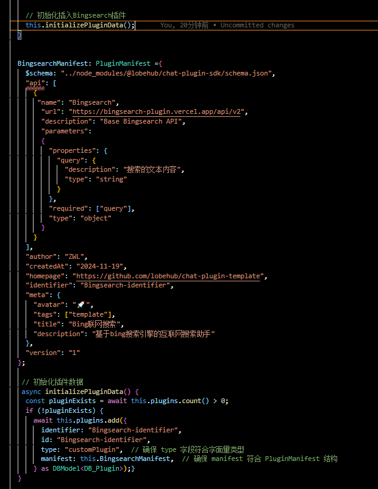

<a name="readme-top"></a>

<div align="center">


<h1>Plugin Bingsearch<br/><sup>LobeChat Plugin</sup></h1>

This is the plugin Bingsearch for LobeChat plugin development

[![][🤯-🧩-lobehub-shield]][🤯-🧩-lobehub-link]
[![][github-release-shield]
[![][github-contributors-shield]][github-contributors-link]
[![][github-forks-shield]][github-forks-link]
[![][github-stars-shield]][github-stars-link]
[![][github-issues-shield]][github-issues-link]
[![][github-license-shield]][github-license-link]

[Changelog](./CHANGELOG.md) · [Report Bug][github-issues-link] · [Request Feature][github-issues-link]


</div>

<details>
<summary><kbd>Table of contents</kbd></summary>

#### TOC

- [🌟 Features](#-features)
- [🤯 Usage](#-usage)
- [⌨️ Local Development](#️-local-development)
- [🤝 Contributing](#-contributing)
- [🔗 Links](#-links)

#### 

</details>

## 🌟 Features

- [X]  💨 **dev1里这是基于私有化部署的BINGSEARCH插件方案
- [X]  📚 **只包含后端API，不包含前端UI的版本
- [X]  🔄 **需要在私有化部署时自行添加环境变量BING_API，开发条件下，请自行替换默认api即可
- [X]  **🖱️**在LOBECHAT中需要在db.ts中设置默认初始化插件，即可不需要通过插件市场，直接导入初始化BING使用，这里是只适用于私有化部署的方案！！！！

<div align="right">

[![][back-to-top]](#readme-top)

</div>

## 🤯 Usage

需要在私有化部署时自行添加环境变量BING_API，开发条件下，请自行替换默认api即可

在LOBECHAT中需要在db.ts中设置默认初始化插件，即可不需要通过插件市场，直接导入初始化BING使用，这里是只适用于私有化部署的方案！！！！下面展示私有化部署的lobechat中db.ts中的内容：



这个链接https://github.com/FineHow/lobe-chat<div align="right">源码可以审阅（我空了git一下

[![][back-to-top]](#readme-top)

</div>

## ⌨️ Local Development

You can use Github Codespaces for online development:

[![][github-codespace-shield]][github-codespace-link]

Or clone it for local development:

[![][bun-shield]][bun-link]

```bash
$ git clone https://github.com/FineHow/Bingsearch-Plugin.git
$ cd Bingsearch-Plugin
$ pnpm install
$ pnpm dev
```

<div align="right">

[![][back-to-top]](#readme-top)

</div>

## 🤝 Contributing

Contributions of all types are more than welcome, if you are interested in contributing plugin, feel free to show us what you’re made of.

[![][pr-welcome-shield]][pr-welcome-link]

<div align="right">

[![][back-to-top]](#readme-top)

</div>

## 🔗 Links

- **[🤖 Lobe Chat](https://github.com/lobehub/lobe-chat)** - An open-source, extensible (Function Calling), high-performance chatbot framework. It supports one-click free deployment of your private ChatGPT/LLM web application.
- **[🧩 / 🏪 Plugin Index](https://github.com/lobehub/lobe-chat-plugins)** - This is the plugin index for LobeChat. It accesses index.json from this repository to display a list of available plugins for Function Calling to the user.

<div align="right">

[![][back-to-top]](#readme-top)

</div>

---

#### 📝 License

Copyright © 2023 [LobeHub][profile-url]. <br />
This project is [MIT](./LICENSE) licensed.

<!-- LINK GROUP -->

[🤯-🧩-lobehub-link]: https://github.com/lobehub/lobe-chat-plugins
[🤯-🧩-lobehub-shield]: https://img.shields.io/badge/%F0%9F%A4%AF%20%26%20%F0%9F%A7%A9%20LobeHub-Plugin-95f3d9?labelColor=black&style=flat-square
[back-to-top]: https://img.shields.io/badge/-BACK_TO_TOP-151515?style=flat-square
[bun-link]: https://bun.sh
[bun-shield]: https://img.shields.io/badge/-speedup%20with%20bun-black?logo=bun&style=for-the-badge
[chat-plugin-realtime-weather]: https://github.com/lobehub/chat-plugin-realtime-weather
[chat-plugin-sdk]: https://github.com/lobehub/chat-plugin-sdk
[chat-plugin-search-engine]: https://github.com/lobehub/chat-plugin-search-engine
[chat-plugin-web-crawler]: https://github.com/lobehub/chat-plugin-web-crawler
[chat-plugins-gateway]: https://github.com/lobehub/chat-plugins-gateway
[fc-link]: https://sspai.com/post/81986
[github-action-release-link]: https://github.com/FineHow/Bingsearch-Plugin/actions/workflows/release.yml
[github-action-release-shield]: https://img.shields.io/github/actions/workflow/status/FineHow/Bingsearch-Plugin/release.yml?label=release&labelColor=black&logo=githubactions&logoColor=white&style=flat-square
[github-action-test-link]: https://github.com/FineHow/Bingsearch-Plugin/actions/workflows/test.yml
[github-action-test-shield]: https://img.shields.io/github/actions/workflow/status/FineHow/Bingsearch-Plugin/test.yml?label=test&labelColor=black&logo=githubactions&logoColor=white&style=flat-square
[github-codespace-link]: https://codespaces.new/FineHow/Bingsearch-Plugin
[github-codespace-shield]: https://github.com/codespaces/badge.svg
[github-contrib-link]: https://github.com/FineHow/Bingsearch-Plugin/graphs/contributors
[github-contrib-shield]: https://contrib.rocks/image?repo=lobehub%2Fchat-plugin-Bingsearch
[github-contributors-link]: https://github.com/FineHow/Bingsearch-Plugin/graphs/contributors
[github-contributors-shield]: https://img.shields.io/github/contributors/FineHow/Bingsearch-Plugin?color=c4f042&labelColor=black&style=flat-square
[github-forks-link]: https://github.com/FineHow/Bingsearch-Plugin/network/members
[github-forks-shield]: https://img.shields.io/github/forks/FineHow/Bingsearch-Plugin?color=8ae8ff&labelColor=black&style=flat-square
[github-issues-link]: https://github.com/FineHow/Bingsearch-Plugin/issues
[github-issues-shield]: https://img.shields.io/github/issues/FineHow/Bingsearch-Plugin?color=ff80eb&labelColor=black&style=flat-square
[github-license-link]: https://github.com/FineHow/Bingsearch-Plugin/blob/main/LICENSE
[github-license-shield]: https://img.shields.io/github/license/FineHow/Bingsearch-Plugin?color=white&labelColor=black&style=flat-square
[github-release-link]: https://github.com/FineHow/Bingsearch-Plugin/releases
[github-release-shield]: https://img.shields.io/github/v/release/FineHow/Bingsearch-Plugin?color=369eff&labelColor=black&logo=github&style=flat-square
[github-releasedate-link]: https://github.com/FineHow/Bingsearch-Plugin/releases
[github-releasedate-shield]: https://img.shields.io/github/release-date/FineHow/Bingsearch-Plugin?labelColor=black&style=flat-square
[github-stars-link]: https://github.com/FineHow/Bingsearch-Plugin/network/stargazers
[github-stars-shield]: https://img.shields.io/github/stars/FineHow/Bingsearch-Plugin?color=ffcb47&labelColor=black&style=flat-square
[lobe-chat-plugins]: https://github.com/lobehub/lobe-chat-plugins
[pr-welcome-link]: https://github.com/FineHow/Bingsearch-Plugin/pulls
[pr-welcome-shield]: https://img.shields.io/badge/%F0%9F%A4%AF%20PR%20WELCOME-%E2%86%92-ffcb47?labelColor=black&style=for-the-badge
[profile-url]: https://github.com/lobehub
