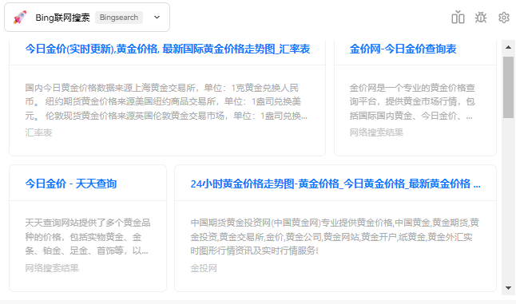
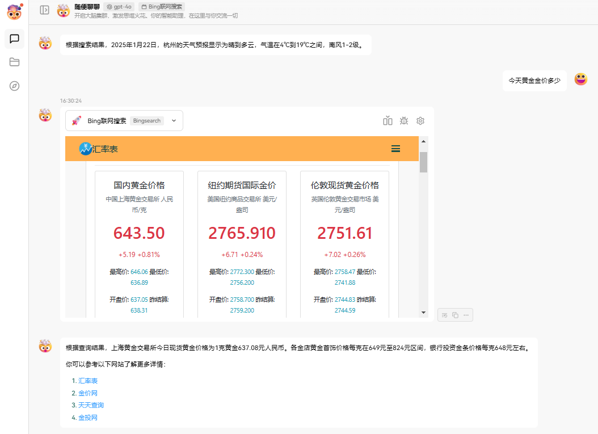

<a name="readme-top"></a>

<div align="center">


<h1>Plugin Bingsearch<br/><sup>LobeChat Plugin</sup></h1>

This is the plugin Bingsearch for LobeChat plugin development

[Changelog](./CHANGELOG.md) · [Report Bug][github-issues-link]https://github.com/FineHow/Bingsearch-Plugin/issues · [Request Feature][github-issues-link]https://github.com/FineHow/Bingsearch-Plugin/issues


</div>

<details>
<summary><kbd>Table of contents</kbd></summary>

#### TOC

- [🌟 Features](#-features)
- [🤯 私有化 Usage](#-私有化-usage)
- [⌨️ Local Development](#️-local-development)
- [🤝 Contributing](#-contributing)

</details>

## 🌟 Features

1. 注册微软账号，可免费使用bing search搜索API服务，BING SEARCH 免费提供3个链接返回结果，实际可返回十个链接搜索结果。详情见[https://www.microsoft.com/en-us/bing/apis](https://www.microsoft.com/en-us/bings/apis)
2. 本插件提供预览前端页面，点击标题 网页内嵌至插件，点击内容详情 跳转至网页。
3. 



<div align="right">

[![][back-to-top]](#readme-top)

</div>

## 🤯 私有化 Usage

> 基于私有化部署的 BINGSEARCH 插件方案，不仅可以部署 bingsearch, 也可根据用户需求，自主修改插件市场的内容，可以开发多个 lobechat 私有插件，私有化部署。

1. **通过 docker 提供 bingsearch 私有化部署**
2. docker 完成打包之后，将 lobechat 中的环境变量 PLUGINS_INDEX_URL 插件市场路径替换成本项目部署的 镜像地址 /index.json (本地为[http://localhost:3400/index.json](http://localhost:3400/index.json)) , 如果除了 bingsearch 插件以外还想使用官方的插件，只需要将官方的插件市场路径添加到本项目的 /index.json 中即可。
3. 需要在私有化部署时自行添加环境变量 BING_API，开发条件下，请自行替换默认 api 即可

```
npm install
npm build
docker build --pull --rm -f "dockerfile" -t bingsearchplugin_local:v1.0 "."
```

* 启动[http://localhost:3000](http://localhost:3000), 打开 lobechat, 添加环境变量 PLUGINS_INDEX_URL：[http://localhost:3000/index.json](http://localhost:3000/index.json)

[![][back-to-top]](#readme-top)

</div>

## ⌨️ Local Development

```
npm install
npm build
npm run dev
```

</div>

## 🤝 Contributing

Contributions of all types are more than welcome, if you are interested in contributing plugin, feel free to show us what you’re made of.

<div align="right">

[![][back-to-top]](#readme-top)</div>

<div align="right">

[![][back-to-top]](#readme-top)

</div>

---

#### 📝 License

Copyright © 2023 [LobeHub][profile-url]https://github.com/lobehub. <br />
This project is [MIT](./LICENSE) licensed.

<!-- LINK GROUP -->

[🤯-🧩-lobehub-link]: https://github.com/lobehub/lobe-chat-plugins
[🤯-🧩-lobehub-shield]: https://img.shields.io/badge/%F0%9F%A4%AF%20%26%20%F0%9F%A7%A9%20LobeHub-Plugin-95f3d9?labelColor=black&style=flat-square
[back-to-top]: https://img.shields.io/badge/-BACK_TO_TOP-151515?style=flat-square
[github-contributors-link]: https://github.com/FineHow/Bingsearch-Plugin/graphs/contributors
[github-contributors-shield]: https://img.shields.io/github/contributors/FineHow/Bingsearch-Plugin?color=c4f042&labelColor=black&style=flat-square
[github-forks-link]: https://github.com/FineHow/Bingsearch-Plugin/network/members
[github-forks-shield]: https://img.shields.io/github/forks/FineHow/Bingsearch-Plugin?color=8ae8ff&labelColor=black&style=flat-square
[github-issues-link]: https://github.com/FineHow/Bingsearch-Plugin/issues
[github-issues-shield]: https://img.shields.io/github/issues/FineHow/Bingsearch-Plugin?color=ff80eb&labelColor=black&style=flat-square
[github-license-link]: https://github.com/FineHow/Bingsearch-Plugin/blob/main/LICENSE
[github-license-shield]: https://img.shields.io/github/license/FineHow/Bingsearch-Plugin?color=white&labelColor=black&style=flat-square
[github-stars-link]: https://github.com/FineHow/Bingsearch-Plugin/network/stargazers
[github-stars-shield]: https://img.shields.io/github/stars/FineHow/Bingsearch-Plugin?color=ffcb47&labelColor=black&style=flat-square
[pr-welcome-link]: https://github.com/FineHow/Bingsearch-Plugin/pulls
[pr-welcome-shield]: https://img.shields.io/badge/%F0%9F%A4%AF%20PR%20WELCOME-%E2%86%92-ffcb47?labelColor=black&style=for-the-badge
[profile-url]: https://github.com/lobehub
